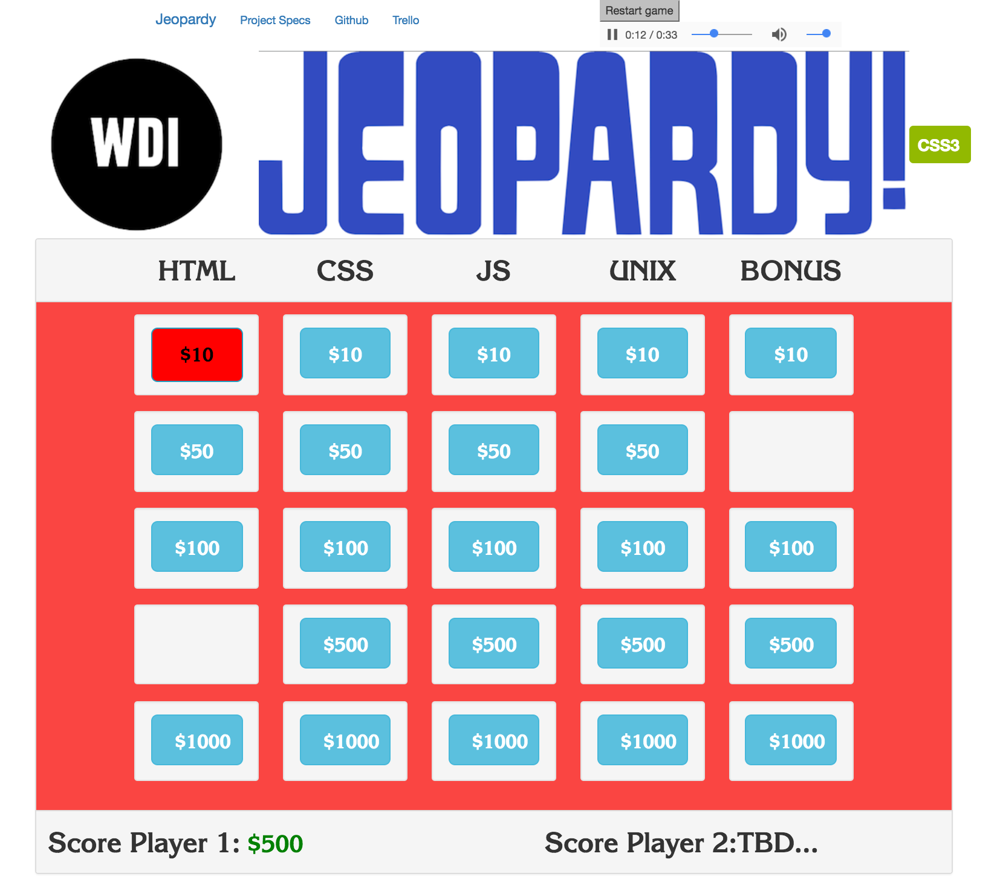
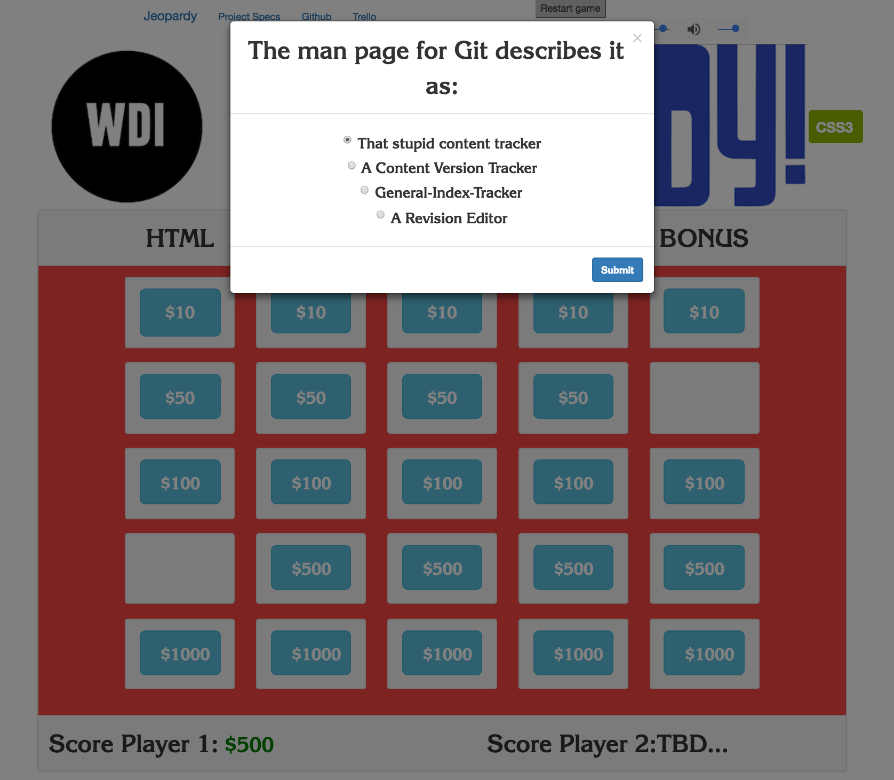

## [Live Deployment on Netlify, Click to Play](https://webdev-jeopardy.netlify.app/)

*Get Started:*

Using git from the command line:

 1. Clone Repository
 2. Turn on your audio (Optional... but highly reccomended!)
 3. Open index.html in your web browser `open public/index.html`
 4. Enjoy

<!-- Using Docker via [Dockerhub](https://hub.docker.com/repository/docker/airbr/webdev-jeopardy):

1. `docker run -d -P --name jeopardy airbr/webdev-jeopardy` 
2. `docker port jeopardy`
3. Visit at the ports assigned! -->

### Web Dev Jeopardy by Morgan Murrah - v4.0

 
 

### Current Game:

This game started as one of my first ever web projects and was my first application of HTML, CSS, Javsacript and JQuery. This was my beginning. 
#### Future develoment:

* Performance optimize the game by running Lighthouse Audits
* Make the game competitive/two player
* Add a high-score table, or way of saving/sharing a score result

### Older Screenshots:

#### Technologies used in this game include:

 * HTML5
 * CSS3
 * Bootstrap 3.3.7
 * JQuery

Resources referred to include:

* [CSS Grid](https://developer.mozilla.org/en-US/docs/Web/CSS/CSS_Grid_Layout)
* [Bootstrap Modal](http://www.w3schools.com/bootstrap/bootstrap_modal.asp)
* [JSON Howto](http://www.w3schools.com/json/json_eval.asp)
* [Bootstrap JS Modals documentation](https://getbootstrap.com/javascript/#modals)
* [jQuery API documentation](https://api.jquery.com/)

