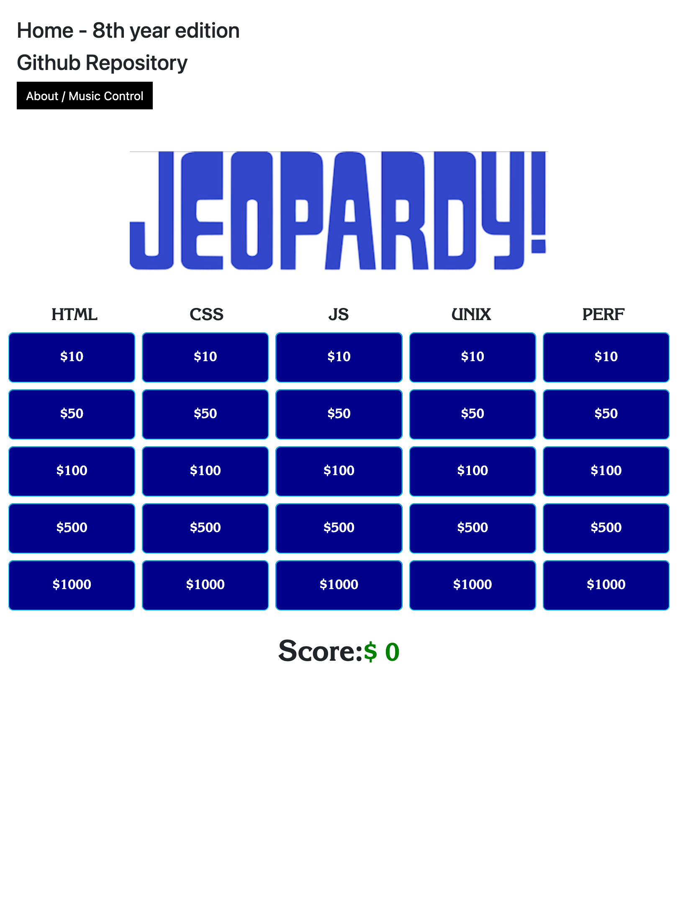

## [Live Deployment on Netlify, Click to Play](https://webdev-jeopardy.netlify.app/)

# Web Dev Jeopardy by Morgan Murrah - v7.0 - 2025 Career Update Edition!

This game started as one of my first ever web projects in 2016 and was my first application of HTML, CSS, Javsacript and JQuery. This was my beginning. 

### Current Game:

In 2025 I have started to revisit this project for some fun and upgraded the libraries used and refactored to make them work.

A trimmed down and spruced up version of the game to celebrate 8 years in the industry.

* Added a new line of questions
* Upgraded Bootstrap to v5.3.3
* Upgraded JQuery to 3.7.1

#### Future development:

* Performance optimize the game by running Lighthouse Audits
* Make the game competitive/two player
* Add a high-score table, or way of saving/sharing a score result

#### Technologies used in this game include:

 * HTML5
 * CSS3
 * ~~Bootstrap 3.3.7~~
    * Bootstrap Upgraded to 5.0.2
 * ~~JQuery 3.1~~
    * jQuery Upgraded to 3.6.3

Resources referred to include:

* [CSS Grid](https://developer.mozilla.org/en-US/docs/Web/CSS/CSS_Grid_Layout)
* [Bootstrap JS Modals documentation](https://getbootstrap.com/javascript/#modals)
* [jQuery API documentation](https://api.jquery.com/)

