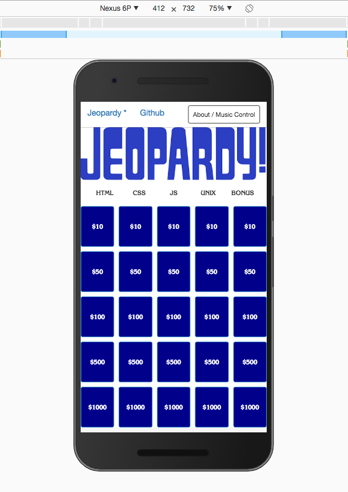

## [Live Hosting on Firebase](https://wdijeopardy.firebaseapp.com)

*Get Started:*

**Terminal**

* 1. Clone Repository ``git clone https://github.com/airbr/WDI7-Jeopardy``
* 2. Change into the directory ``cd ./Project1-Jeopardy``
* 3. Turn on your audio (Optional... but highly reccomended!)
* 4. Open index.html in your web browser ``open public/index.html``
* 5. Enjoy!

--
### WDI Jeopardy by Morgan Murrah - v2.0

This game started as one of my earliest projects and was my first application of HTML, CSS, Javsacript and JQuery. This was also originally project one from taking the web development immersive at General Assembly. I have been adding bits and pieces to it since then.

### Current version: V2.0:

This game has been simplified/ a lot of refactoring of my horrible earlier code. The game now makes use of the new CSS Grid specification [which is not fully supported yet](http://caniuse.com/#feat=css-grid). Since its a simple game I figured its a great place to try this new shiny thing in the world of CSS. 

### Current Game:

### Older Screenshots:

#### Future develoment:

* Make the game competitive/two player
* Add a high-score table, or way of saving/sharing a score result

#### Technologies used in this game include:

 * HTML5
 * CSS3
 * Bootstrap 3.3.7
 * JQuery

Resources referred to include:

* [CSS Grid] (https://developer.mozilla.org/en-US/docs/Web/CSS/CSS_Grid_Layout)
* [Bootstrap Modal](http://www.w3schools.com/bootstrap/bootstrap_modal.asp)
* [JSON Howto](http://www.w3schools.com/json/json_eval.asp)
* [Bootstrap JS Modals documentation](https://getbootstrap.com/javascript/#modals)
* [jQuery API documentation](https://api.jquery.com/)

